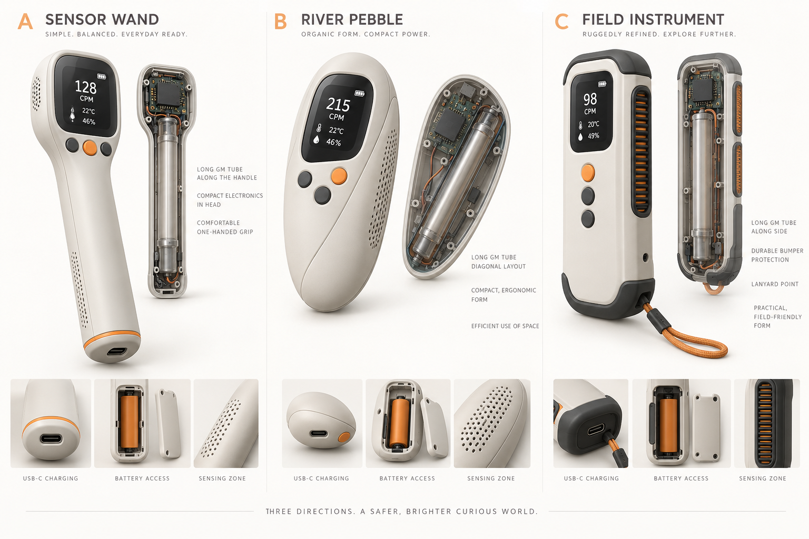
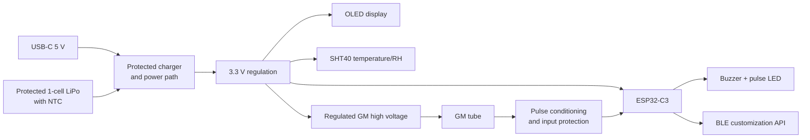

<p align="center">
  
</p>

<p align="center">
  <strong>IonTrail One</strong><br>
  A pocketable environmental radiation counter designed to be explored, extended, and made your own.
</p>

<p align="center">
  <a href="https://kelvinchan324.github.io/IonTrail-One/"><strong>Product page</strong></a> ·
  <a href="docs/quickstart.md">SDK quick start</a> ·
  <a href="docs/hardware.md">Hardware architecture</a> ·
  <a href="docs/customization.md">Customization guide</a>
</p>

<p align="center">
  
  
  
</p>

---

## See the invisible environment

IonTrail One is a planned consumer environmental instrument built around a Geiger–Müller tube, an ESP32-C3, and temperature/humidity sensing. Its river-pebble enclosure uses a smoked transparent back to reveal the tube and custom PCB, while a structural loop lets it travel on a bag or lanyard.

The product is designed for home science, STEM learning, makers, collectors, and people curious about the world around them. CPM/CPS is the primary radiation measurement; environmental readings provide context for experiments and logged observations.

> **Development status:** concept and EVT planning. Dimensions, battery life, radiation response, dose conversion, ingress protection, and accuracy are not final specifications until verified on production-representative hardware.

## Product principles

| Principle | What it means |
| --- | --- |
| Understandable | The main screen explains the current count rate without presenting an unverified “safe/unsafe” judgement. |
| Customizable | The public SDK exposes count events, CPM, environmental readings, alarms, logging, and display hooks. |
| Repairable | A screwed enclosure, replaceable subassemblies, test points, and versioned hardware documentation are preferred. |
| Honest | Dose-rate estimates remain optional and require tube-specific calibration data supplied by the user or manufacturer. |
| Safe by design | The high-voltage section is physically guarded, current-limited, and inaccessible despite the transparent back. |

## Planned hardware



The ESP32-C3 SuperMini is used for fast EVT prototypes. A sellable revision should use a certified ESP32-C3 module on a custom PCB with traceable power components, protected battery charging, controlled high voltage, and production test points.

Read the full [hardware architecture](docs/hardware.md) and [prototype BOM](docs/bom.md).

## SDK overview

The SDK is organized as a small Arduino/PlatformIO library. Applications can subscribe to count-rate data, change display behavior, implement their own alarms, add BLE services, or connect additional I2C sensors without rewriting the pulse-counting core.

```cpp
#include <IonTrail.h>

IonTrailDevice ionTrail;

void setup() {
  IonTrailConfig config;
  config.gmPulsePin = 3;
  config.sampleWindowMs = 10000;
  config.deadTimeMicros = 0; // Enable only with characterized tube data.
  ionTrail.begin(config);
}

void loop() {
  ionTrail.update();

  if (ionTrail.hasFreshReading()) {
    Serial.printf("CPM: %.1f  Total: %lu\n",
                  ionTrail.cpm(),
                  ionTrail.totalCounts());
  }
}
```

### What customers can customize

- Screen layouts, icons, units, languages, and themes
- Count-click sound, LED behavior, and alarm thresholds
- BLE characteristics and companion applications
- CSV/JSON logging and cloud integrations
- Environmental sensors on the shared I2C expansion bus
- Experiment modes and classroom activities
- Tube-specific calibration profiles
- Power-saving and sampling strategies

The initial library deliberately does **not** make a universal CPM-to-µSv/h conversion. See [calibration and claims](docs/safety.md).

## Start developing

1. Install [Visual Studio Code](https://code.visualstudio.com/) and [PlatformIO](https://platformio.org/).
2. Clone this repository.
3. Connect an ESP32-C3 SuperMini by USB.
4. Review and confirm the pins in `include/iontrail_board.h` against your exact board revision.
5. Build and upload the default environment:

```bash
pio run
pio run --target upload
pio device monitor
```

See the [quick-start guide](docs/quickstart.md) before connecting any GM high-voltage hardware.

## Repository map

```text
IonTrail-One/
├── include/                 Board-level pin configuration
├── lib/IonTrail/            Reusable SDK library
├── src/                     Reference firmware application
├── examples/                Customer customization examples
├── docs/                    Product, hardware and SDK documentation
├── platformio.ini           Reproducible ESP32-C3 build
├── CONTRIBUTING.md          Contribution workflow
└── LICENSE                  MIT SDK licence
```

## Safety boundary

IonTrail One is an educational and environmental-monitoring project. It is not a certified personal dosimeter, contamination survey meter, medical device, or proof that an environment is safe. A GM circuit can contain several hundred volts even when powered by a small battery. Use a current-limited design, discharge path, insulating guard, and appropriate test equipment. Never connect a tube or high-voltage node directly to an ESP32 pin.

Read [Safety, calibration and product claims](docs/safety.md) before modifying detector hardware or publishing measurements.

## Contributing

Issues, documentation improvements, display themes, sensor integrations, translations, and tested hardware profiles are welcome. Keep safety-critical changes explicit and include test evidence where practical. See [CONTRIBUTING.md](CONTRIBUTING.md).

## Licence

The SDK and repository content are available under the [MIT License](LICENSE). Product names and logos are not granted for use as trademarks. Third-party libraries and hardware modules retain their own licences and terms.
