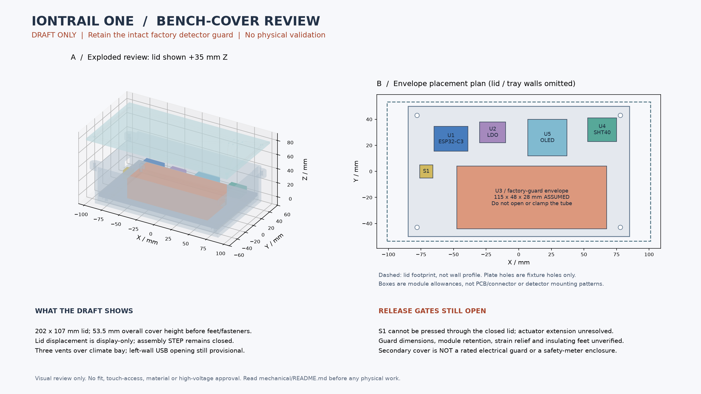

# Secondary bench cover — editable draft, not an electrical guard

Retain the **complete factory SEN0463 enclosure**. This outer cover does not
replace it or certify protection against electric shock, dust, moisture, fire,
drops or access through openings. No pocket or wearable use is approved.

Files:

- [Parameters](enclosure-parameters.json) and [computed checks](enclosure-checks.json).
- [Tray STEP](bench-tray-draft.step) / [STL](bench-tray-draft.stl).
- [Lid STEP](bench-lid-draft.step) / [STL](bench-lid-draft.stl).
- [Assembly with original fixture and component envelopes](enclosure-layout.step).

Generate using `python tools/build_enclosure.py` with CadQuery 2.8.0 after
`python tools/build_engineering.py --cad`. The part generator verifies connected
positive solids, no reference-envelope or fixture-plate intrusion and STEP
roundtrips. It does not model screws, cables, plug insertion or material strength.

## Geometry and fastening

Original fixture datum is unchanged: plate bottom Z=0, top Z=4 mm. Tray bottom
extends to Z=-9; the underside datum is now -9, not the old fixture datum.
Through-bolt heads/nuts may project below it: insulating feet or clearance
supports are still required and not modeled. Do not rest the assembly on fasteners.
The lid footprint is 202 x 107 mm and overall height is 53.5 mm. Four 6 mm-high
support bosses line up with the existing plate holes at X=±78, Y=±43 mm.
Do not confuse these holes with detector or module mounting patterns.

Lid bolts use external ears at X=±95, Y=±43 mm, keeping hardware outside the
detector bay. Holes are 3.4 mm; M3x16 through-bolts are candidates only. Check
washer/nut/tool access and thread engagement on the actual manufactured parts.
The lid is a flat transparent-material candidate, not a proven clear 3D print.
There is no gasket or light-seal performance claim.

The left-wall USB opening is provisional: verify the board connector orientation,
plug size and cable bend before fabrication. Three lid vents are above the
environment sensor, not over the detector. Their existence is not a touch-probe
assessment. The reset button cannot be operated with this lid closed; its
extension actuator remains unresolved. Power must be removed before lid removal.

## Guard retention is deliberately not guessed

The [vendor specification](https://wiki.dfrobot.com/sen0463/) lists a 107 x 42 mm
board. The retained 115 x 48 x 28 mm envelope is an **assumed guard allowance**,
not a measured outer case. No new holes, clamp pressure or fastener force on the
factory guard/tube is specified. Modules are not secured merely by enclosing them.
Do not power, transport or shake this draft until proper retention is reviewed.

## Measurement and CAD lesson

1. With all supplies removed, measure the intact exterior without disassembly.
2. Record guard dimensions, allowed factory mounting points, low-voltage cable
   exit and clearance. Photograph external evidence; never expose the HV section.
3. Update the envelope and regenerate both layout and cover. Investigate any
   intrusion error rather than suppressing it.
4. Design a removable adapter using verified factory mounting features. Do not
   assume adhesive or pressure against a tube is acceptable retention.
5. Prototype fit with inert dummy blocks first. Record wire pinch, plug access,
   lid bow and fastener stack before considering electronics.

| Required measurement | Evidence |
| --- | --- |
| Factory guard W/D/H and allowed retention interfaces | pending |
| Board/connector positions and cable clearance | pending |
| Plate bolt stack and lid-ear nut/tool clearance | pending |
| Insulating feet / underside fastener clearance and stability | pending |
| Transparent lid readability and button solution | pending |
| Material, thickness tolerance, deflection and thermal suitability | pending |
| Positive retention, strain relief and accessible-opening review | pending |

Release remains blocked on these measurements and the
[power/thermal review](../docs/power-review.md). No physical tests have run.

## Visual handoff and source freshness



The left view uses the saved tray, lid and fixture STEP solids with the six
component-envelope boxes. The lid is displaced **35 mm upward for illustration
only**; the original assembly file remains closed. Translucency is an inspection
aid, not a verified material property. The right view omits lid and tray walls to
show component positions: dashed outline is the lid extent, not a wall profile.
Fixture holes are not module mounting patterns. No power wiring is depicted.

The render was visually checked, including correction of an overlapping axis
caption. The plan makes the current division between the guarded detector and
low-voltage electronics clear. It does not establish an electrical isolation
distance or prevent a loose module crossing that division. S1's inaccessible
closed-lid position, missing module retention and underside feet remain release
blockers, not details to overlook during assembly.

Reproduce with CadQuery 2.8.0 and Matplotlib 3.11.2:

```sh
python tools/render_enclosure_review.py
python -m pytest tests/test_visual_review.py
```

The [ledger](enclosure-visual-review.json) records input/image hashes, versions
and nine matched bodies. Before drawing, the renderer checks one-to-one body
volumes (within 1e-4 mm3) and bounds (within 1e-4 mm) against enclosure-layout.step,
plus the lid's bottom datum against parameters. This is not a topological
identity, fit, intrusion, retention or electrical-safety proof. STEP geometry is
not rewritten. Text hashes normalize CRLF to LF; STEP/PNG preserve native bytes.
The regular Python CI suite flags stale source/image hashes without installing
CAD libraries. Regenerate **and visually inspect** after changing source files.
